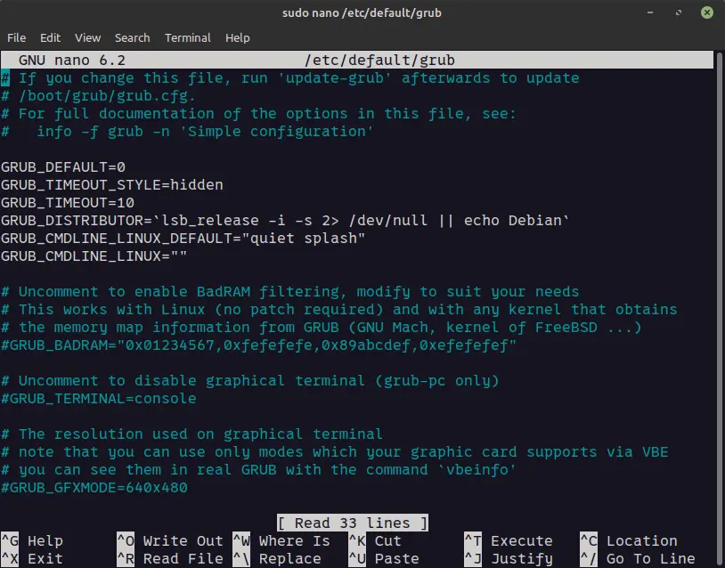
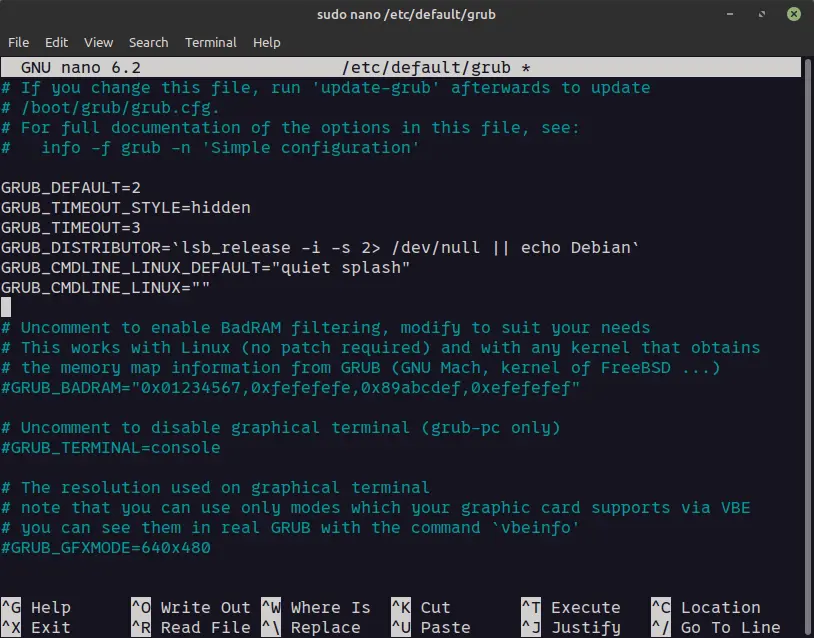
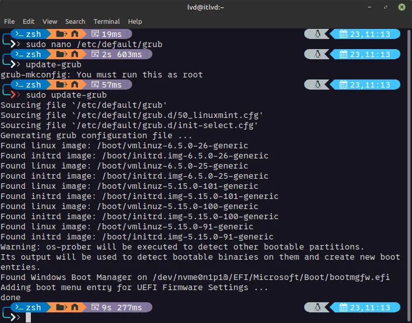

Many people install dual boot both Windows and Linux. Some of them prefer set up Linux as a primary Operating System while some want to set Windows as their primary OS.

After you install dual boot and start your computer, the Grub boot options will appear for you to choose, OS which you want to enter. If you prefer to have Windows as primary OS, this is inconvenient. The good news is that you can customize the priority OS in Grub boot.

In this tutorial, I will show you a graphical method to change a grub boot order and make Windows is default.

## Option 1: Use Grub-customizer

If you want to have an UI to setup, you can access the artical below that shows step-to-step method. This post is not focus to UI setting, but you can access another post or run this command and custom what you like.

```bash
sudo apt install grub-customizer
```

[Change Grub Boot Order and Make Windows Default](https://itsfoss.com/grub-customizer-ubuntu/)

## Option 2: Use Grub file in the system

Firstly, you open grub file in nano editor. Make sure you have a copy version if you are not sure what you do.

```bash
sudo nano /etc/default/grub
```

The next, you will see a content in grub file.



Please pay attention to `GRUB_DEFAULT` and `GRUB_TIMEOUT` .

You can change the order to `2` to make Windows is default (sometimes this is a default). You determine the order by rebooting Linux and looking at the order of Windows boot options in Grub boot and start from `0`.

**💡 If you want grub remeber the last choice. You can set:**

> GRUB\_DEFAULT=saved

> GRUB\_SAVEDEFAULT=true

Read more at [offical document](https://www.gnu.org/software/grub/manual/grub/grub.html#Simple-configuration:~:text=If%20this%20option%20is%20set%20to%20%E2%80%98true%E2%80%99%2C%20then%2C%20when%20an%20entry%20is%20selected%2C%20save%20it%20as%20a%20new%20default%20entry%20for%20use%20by%20future%20runs%20of%20GRUB).

In the other hand, you can set the timeout for waiting to select OS in `GRUB_TIMEOUT` .



Then press `Ctrl + X` then `y`, the last is `Enter` to save the file.

The last, you run this command to update grub.

```bash
sudo update-grub
```



Now, please restart your computer and check again.

I hope this tutorial help to solve your issue.
